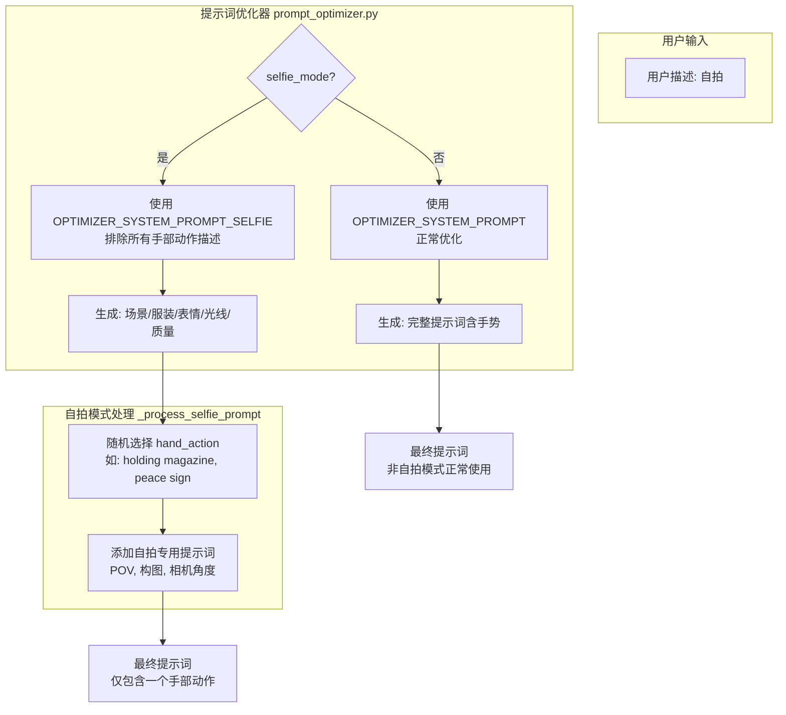
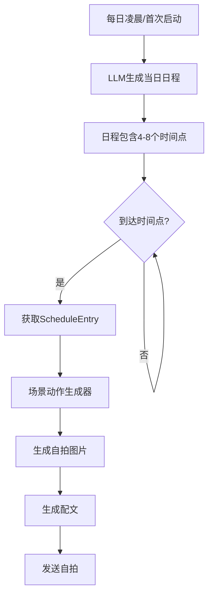
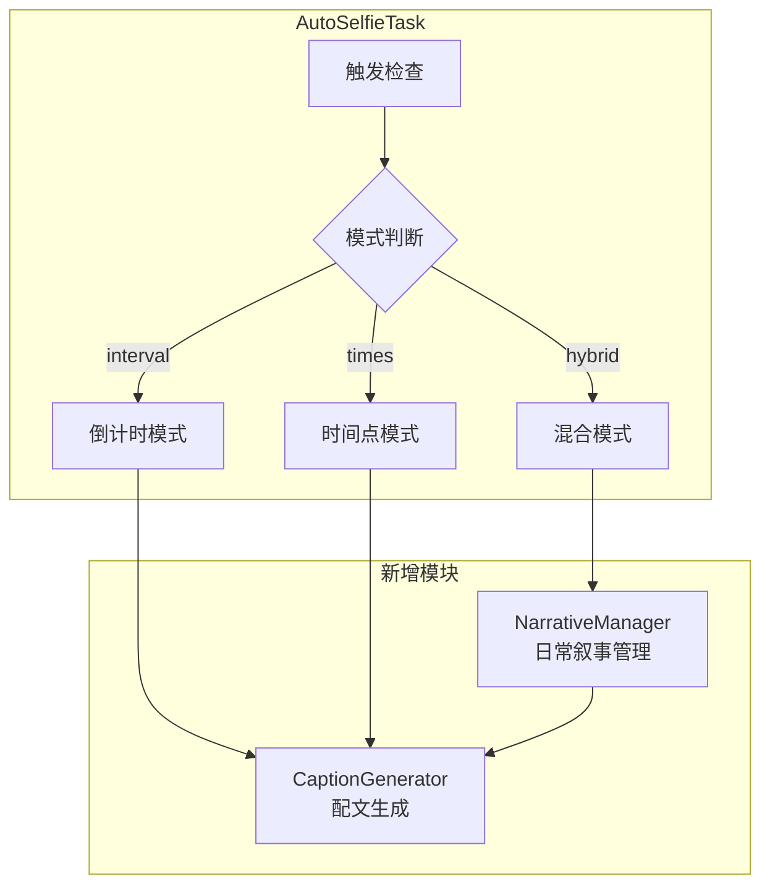

# Custom Pic Plugin - 新功能添加说明

> **修改版定位**：本修改版专注于**定时发送自拍**功能，让Bot更像真人；同时主要对**魔搭模型**进行优化，内置7个精选魔搭模型预设配置，提供开箱即用的体验。

## 版本对比

| 项目 | 原版插件 (v3.3.3) | 修改版插件 (v3.5.3) |
|------|-------------------|---------------------------|
| 版本号 | 3.3.3 | 3.5.3 |
| 文件数量 | 18个文件 | 33个文件 |
| 新增文件 | 0个 | 15个 |

---

## v3.5.3 修复说明（2026-02-15）

### 🐛 WebUI 配置显示与 config.toml 不同步

- 修复重启后 WebUI 显示旧值的问题（config.toml 实际已更新）
- 修复 `styles` / `style_aliases` 动态字段显示错位问题
- 修复模型分节固定导致的展示不一致，改为按当前 config 动态同步

### 🔐 模型 API Key 默认值安全性修复

- `api_key` 默认值改为空字符串（不再注入 `Bearer xxxxx...` 模板值）
- 保留 Bearer 格式填写说明与 placeholder，引导用户按供应商要求填写

---

## 新增功能详解

### 0. ✋ v3.5.0-beta.7 - 自拍三只手问题修复

#### 问题描述
用户请求自拍时，生成的图片出现三只手：
- 一只手正常持设备（在画面外）
- 一只手做"耶"手势（peace sign）
- 一只手拿杂志

这是因为**提示词优化器**和**自拍模式处理器**同时添加了手部动作描述，造成冲突。

#### 根本原因分析
| 组件 | 添加的内容 | 来源 |
|------|-----------|------|
| `optimize_prompt()` | `(making a peace sign:1.1)` | LLM 根据"自拍"请求自动添加手势 |
| `_process_selfie_prompt()` | `(visible free hand holding a fashion magazine:1.4)` | 随机从 `hand_actions` 列表选择 |

两者都在提示词中添加手部动作，导致图像生成模型创建了多只手。

#### 解决方案：提示词分层架构

**核心设计原则**：自拍模式下，手部动作控制权完全交给 `_process_selfie_prompt()`，提示词优化器专注于场景、服装、表情、光线、质量等描述。



#### 技术实现

**1. prompt_optimizer.py 新增专用系统提示词**
```python
# 自拍模式专用系统提示词 - 不生成手部动作
OPTIMIZER_SYSTEM_PROMPT_SELFIE = """...(省略)...
**CRITICAL RESTRICTION**:
Do NOT include any hand gestures, hand poses, or descriptions of what hands are doing.
Do NOT add: peace sign, V sign, thumbs up, waving, holding anything, etc.
...(省略)...
"""

async def optimize(self, user_description: str, exclude_hand_actions: bool = False):
    if exclude_hand_actions:
        system_prompt = OPTIMIZER_SYSTEM_PROMPT_SELFIE
    else:
        system_prompt = OPTIMIZER_SYSTEM_PROMPT
```

**2. pic_action.py 调用时传入参数**
```python
# 自拍模式下排除手部动作描述，由 _process_selfie_prompt 统一控制
success, optimized_prompt = await optimize_prompt(
    description,
    self.log_prefix,
    exclude_hand_actions=selfie_mode  # 自拍模式时为 True
)
```

#### 职责分离表

| 组件 | 职责范围 | 自拍模式下的行为 |
|------|---------|-----------------|
| `optimize_prompt()` | 场景、服装、表情、光线、构图、质量 | 使用 `OPTIMIZER_SYSTEM_PROMPT_SELFIE`，不生成手部描述 |
| `_process_selfie_prompt()` | 手部动作、POV视角、相机角度 | 随机选择一个 `hand_action`，添加自拍专用构图提示词 |
| `_apply_selfie_negative_prompt()` | 负面提示词 | 添加防双手/多手的负面提示词 |

#### 修改的文件
| 文件 | 修改内容 |
|------|---------|
| `core/prompt_optimizer.py` | 新增 `OPTIMIZER_SYSTEM_PROMPT_SELFIE`，`optimize()` 和 `optimize_prompt()` 新增 `exclude_hand_actions` 参数 |
| `core/pic_action.py` | 调用 `optimize_prompt()` 时传入 `exclude_hand_actions=selfie_mode` |

#### 效果验证
- ✅ 自拍图片中只有一只空闲手（做动作的手）
- ✅ 持设备的手完全在画面外
- ✅ 不再出现多余的手部动作（如同时出现 peace sign + holding magazine）
- ✅ 非自拍模式不受影响

---

### 0.1 🗑️ v3.5.0-beta.5 - 移除角色配置功能

#### 功能描述
v3.5.0-beta.5 版本完全移除了 `character_name` 和 `character_persona` 功能，简化日程生成流程。人物外观特征完全由 `selfie.prompt_prefix` 控制，确保人设稳定性。

#### 核心变更
| 变更类型 | 说明 |
|----------|------|
| 🗑️ **移除 character_name** | 日程生成不再使用角色名称 |
| 🗑️ **移除 character_persona** | 日程生成不再使用角色人设 |
| ✅ **完全使用 selfie.prompt_prefix** | 人物外观特征（发色、瞳色等）完全由此配置控制，确保人设稳定性 |

#### 技术改进
| 改进项 | 说明 |
|--------|------|
| `schedule_generator.py` | 简化 Prompt 模板，移除角色相关占位符 |
| 函数签名简化 | `_build_generation_prompt()` 和 `_generate_fallback_schedule()` 移除 character_name/character_persona 参数 |
| 代码清理 | 移除 pic_action.py 和 auto_selfie_task.py 中读取这两个配置项的代码 |

---

### 0.2 📝 v3.5.0-beta.4 - 配置结构简化

#### 功能描述
v3.5.0-beta.4 版本重写了 `[auto_selfie]` 配置部分，添加详细中文注释，让用户配置更加清晰易懂。

#### 核心变更
| 变更类型 | 说明 |
|----------|------|
| 📝 **重写 auto_selfie 配置** | 将配置项重新组织为8个清晰的逻辑分组（基础开关、发送时间、发送目标、日程生成、间隔补充、图片生成、配文设置） |
| 🆕 **新增 schedule_times** | 每天发送自拍的时间点列表（24小时制 HH:MM），LLM会根据时间自动生成对应场景 |
| 🗑️ **删除 schedule_mode** | 不再让用户选择模式，统一使用 Smart 模式 |
| 🗑️ **删除废弃配置项** | 删除 narrative_script、narrative_context_length、ask_model_id 等冗余配置 |
| 📝 **详细注释** | 每个配置项都有清晰的中文说明，配置文件顶部添加了功能说明和快速开始指南 |

#### 新增配置项
| 配置键 | 类型 | 默认值 | 说明 |
|--------|------|--------|------|
| `auto_selfie.schedule_times` | list | `["08:00", "12:00", "18:00", "21:00"]` | 每天发送自拍的时间点 |

#### 删除的配置项
| 配置键 | 说明 |
|--------|------|
| `schedule_mode` | 统一使用 Smart 模式，无需选择 |
| `narrative_script` | 已废弃 |
| `narrative_context_length` | 已废弃 |
| `ask_model_id` | 已废弃 |

---

### 0.3 🎲 v3.5.0-beta.3 - 间隔补充发送功能

#### 功能描述
v3.5.0-beta.3 版本为 Smart 模式新增了间隔补充发送功能，让自拍时间更加随机自然，增强\"真人感\"体验。

#### 核心特性
| 特性 | 说明 |
|------|------|
| 🎲 **间隔补充发送** | 在日程时间点之外，也会有概率随机发送自拍 |
| ⏱️ **全局间隔计时器** | 不是每个聊天流独立计时，而是全局共享 |
| 🎯 **智能避让** | 仅在离日程时间点超过 ±30 分钟时才检查 |
| 🎰 **概率控制** | 支持概率控制，默认 30% 触发概率 |

#### 新增配置项
| 配置键 | 类型 | 默认值 | 说明 |
|--------|------|--------|------|
| `auto_selfie.enable_interval_supplement` | bool | `true` | 是否启用间隔补充发送 |
| `auto_selfie.interval_minutes` | int | `120` | 间隔时间（分钟） |
| `auto_selfie.interval_probability` | float | `0.3` | 触发概率（0.0-1.0） |

#### 工作原理
1. 每分钟检查一次，如果当前时间匹配日程条目则按日程发送
2. 如果没有匹配的日程条目，且距离上次间隔发送已超过配置的间隔时间
3. 进行概率检查，通过后触发间隔补充发送
4. 在日程时间点附近（±30分钟）不会触发间隔补充，避免冲突

---

### 0.4 🧠 v3.5.0-beta.2 - Smart智能日程模式（重大更新）

#### 功能描述
v3.5.0-beta.2 版本是定时自拍功能的革命性升级，引入了 **Smart 智能日程模式**。通过 LLM 动态生成每天的完整日程，自拍动作完全由场景决定，不再依赖固定的动作库。这让 Bot 的自拍行为更加自然、真实、拟人化。

#### 核心特性
| 特性 | 说明 |
|------|------|
| 🧠 **LLM动态日程生成** | 每天凌晨由LLM生成完整日程，包含20+字段的丰富场景描述 |
| 🎭 **场景驱动动作** | 自拍动作完全由当前活动决定，不使用固定的hand_actions |
| 🔄 **模式统一** | smart成为默认模式，旧模式(interval/times/hybrid)自动升级 |
| 📊 **多维度场景** | 支持心情、天气、光线、构图、视角等多维度描述 |

#### 新增文件
| 文件 | 说明 |
|------|------|
| `core/schedule_models.py` | 日程数据模型（ScheduleEntry、DailySchedule） |
| `core/schedule_generator.py` | LLM日程生成器 |
| `core/scene_action_generator.py` | 场景动作生成器 |

#### 新增配置项
| 配置键 | 类型 | 默认值 | 说明 |
|--------|------|--------|------|
| `auto_selfie.schedule_mode` | str | `smart` | 默认改为smart模式 |
| `auto_selfie.schedule_generator_model` | str | `""` | 日程生成模型（留空用replyer） |
| `auto_selfie.schedule_min_entries` | int | `4` | 每日最少日程数 |
| `auto_selfie.schedule_max_entries` | int | `8` | 每日最多日程数 |

#### Smart模式工作流程


#### ScheduleEntry 字段说明
| 字段 | 类型 | 说明 |
|------|------|------|
| `time` | str | 时间点（HH:MM） |
| `activity` | str | 当前活动 |
| `location` | str | 地点 |
| `pose` | str | 姿势 |
| `expression` | str | 表情 |
| `clothing` | str | 服装 |
| `action` | str | 正在做的动作 |
| `mood` | str | 心情 |
| `weather` | str | 天气 |
| `lighting` | str | 光线 |
| `camera_angle` | str | 相机角度 |
| `composition` | str | 构图 |
| `background_details` | str | 背景细节 |
| `accessories` | str | 配饰 |
| `hair_state` | str | 发型状态 |
| `selfie_reason` | str | 自拍原因 |
| `caption_hint` | str | 配文提示 |

#### 向后兼容性
- 旧模式(interval/times/hybrid)会自动升级为smart模式
- 旧配置项保留但标记为已废弃
- 升级时保留用户已有配置

---

### 0.5 🔧 v3.5.0-beta.12 - 代码架构精简

#### 功能描述
v3.5.0-beta.12 版本对代码架构进行了重大精简，移除了旧版叙事系统（NarrativeManager），统一使用 Smart 模式。

#### 核心变更
| 变更类型 | 说明 |
|----------|------|
| 🗑️ **删除 narrative_manager.py** | 移除旧版日常叙事管理器（约 535 行代码） |
| 🔧 **精简 selfie_models.py** | 从 384 行精简到约 110 行，只保留 CaptionType 和 CaptionWeightConfig |
| 🔧 **简化 caption_generator.py** | 移除 NarrativeScene 依赖 |
| 🔧 **清理 auto_selfie_task.py** | 移除所有旧版叙事系统引用 |

#### 代码精简效果
- ✅ 总代码量减少约 800 行（约 20%）
- ✅ 移除冗余的 NarrativeScene、DailyNarrativeState、DEFAULT_NARRATIVE_SCRIPTS 类型定义
- ✅ 统一使用 Smart 模式的日程系统（schedule_models.py）

#### 修复的 Bug
- 🐛 **修复手机问题**：修复场景变体中手机描述导致生成带手机图片的问题

---

### 0.6 🎭 配文多样化功能（已精简）

#### 功能描述
v3.5.0 版本引入了配文多样化功能，支持5种配文类型。

#### 当前文件
| 文件 | 说明 |
|------|------|
| `core/selfie_models.py` | 基础数据模型（CaptionType、CaptionWeightConfig） |
| `core/caption_generator.py` | 配文生成器 |

#### 修改文件
| 文件 | 修改内容 |
|------|----------|
| `core/auto_selfie_task.py` | 整合叙事系统，新增hybrid模式 |
| `plugin.py` | 新增7个配置项 |

#### 新增配置项
| 配置键 | 类型 | 默认值 | 说明 |
|--------|------|--------|------|
| `auto_selfie.schedule_mode` | str | `interval` | 新增 `hybrid` 选项 |
| `auto_selfie.interval_probability` | float | `0.3` | hybrid模式interval触发概率 |
| `auto_selfie.enable_narrative` | bool | `true` | 是否启用叙事系统 |
| `auto_selfie.narrative_script` | str | `auto` | 剧本选择 |
| `auto_selfie.narrative_context_length` | int | `5` | 上下文记忆条数 |
| `auto_selfie.caption_types` | list | `[...]` | 启用的配文类型 |
| `auto_selfie.caption_weights` | list | `[...]` | 配文类型权重 |
| `auto_selfie.caption_model_id` | str | `""` | 配文生成模型 |

#### 技术架构


#### 使用示例
开启hybrid模式 + 叙事系统的推荐配置：
```toml
[auto_selfie]
enabled = true
schedule_mode = "hybrid"
schedule_times = ["08:00", "12:00", "18:00", "22:00"]
interval_minutes = 120
interval_probability = 0.3
enable_narrative = true
narrative_script = "auto"
```

#### 配文类型说明
| 类型 | 说明 | 示例 |
|------|------|------|
| `narrative` | 叙事式 | "刚从公司回来，今天好累啊..." |
| `question` | 询问式 | "你们晚饭吃了什么呀？" |
| `share` | 分享式 | "分享一下今天的穿搭~" |
| `monologue` | 独白式 | "突然想念家里的猫了..." |
| `none` | 无配文 | （只发图片，不带文字） |

#### 剧本系统
内置两套剧本，自动根据星期切换：
- **default**（工作日剧本）：早起→上班→午休→下班→晚间
- **weekend**（周末剧本）：睡懒觉→午餐→下午茶→夜生活

#### 向后兼容性
- 现有 `interval` 和 `times` 模式用户不受影响
- `enable_narrative = false` 可完全禁用新系统
- 新模块初始化失败时自动回退到传统方式

---

### 1. ⏰ 定时自拍功能

#### 功能描述
修改版插件新增了定时自拍功能，让MaiBot可以定时自动发送自拍照片，使Bot更像真人。支持睡眠模式，在设定的时间段内不会发送自拍。

#### 新增文件
- [`core/auto_selfie_task.py`](core/auto_selfie_task.py) - 定时自拍任务管理器

#### 配置项
```toml
[auto_selfie]
enabled = false  # 是否启用定时自拍功能（总开关）
interval_minutes = 60  # 自拍间隔时间（分钟），默认60分钟
selfie_style = "standard"  # 自拍风格：standard=标准自拍，mirror=对镜自拍
use_replyer_for_ask = true  # 是否使用麦麦的回复模型生成自然的询问语（推荐开启）
sleep_mode_enabled = true  # 是否开启睡眠模式（默认true）
sleep_start_time = "23:00"  # 睡眠开始时间
sleep_end_time = "07:00"  # 睡眠结束时间
schedule_mode = "interval"  # 调度模式：interval=倒计时，times=指定时间点
schedule_times = ["08:00", "20:00"]  # 指定时间点列表
list_mode = "whitelist"  # 名单模式：whitelist=白名单，blacklist=黑名单
chat_id_list = []  # 聊天ID列表
```

#### 功能特性
- **持久化记忆**：重启麦麦后，定时器不会重置，会自动恢复上次的计时状态
- **多模式调度**：支持固定间隔（倒计时）和固定时间点（如每天8点）两种模式
- **黑白名单**：支持仅允许特定群组（白名单）或排除特定群组（黑名单）
- **场景自定义**：可在配置文件中自定义自拍场景描述
- 按聊天流分别管理定时自拍任务
- 支持自定义定时间隔（5-300分钟）
- 支持两种自拍风格：标准自拍（前置摄像头）和对镜自拍
- 支持睡眠模式：在设定时间段内不发送自拍
- 发送时附带自然的询问语（可使用回复模型生成或使用预设模板）
- 只在活跃的聊天流中发送自拍

---

### 2. 🔍 智能参考搜索功能

#### 功能描述
当用户提到冷门角色名时，插件会自动联网搜索该角色的参考图，并使用视觉AI提取特征（发色、服装等）合并到提示词中，解决模型不认识角色的问题。

#### 新增文件
- [`core/image_search_adapter.py`](core/image_search_adapter.py) - 图片搜索适配器
- [`core/vision_analyzer.py`](core/vision_analyzer.py) - 视觉分析客户端
- [`core/search_engines/__init__.py`](core/search_engines/__init__.py) - 搜索引擎模块初始化
- [`core/search_engines/base.py`](core/search_engines/base.py) - 搜索引擎基类
- [`core/search_engines/bing.py`](core/search_engines/bing.py) - Bing搜索引擎实现

#### 配置项
```toml
[search_reference]
enabled = false  # 是否启用智能参考搜索功能
vision_api_key = ""  # 用于识图的API Key（支持视觉的模型，如 gpt-4o）
vision_base_url = "https://api.openai.com/v1"  # 识图API地址
vision_model = "gpt-4o"  # 视觉模型名称
```

#### 功能特性
- 内置独立的Bing图片搜索引擎，无需依赖外部搜索插件
- 自动搜索角色图片并提取视觉特征
- 将提取的特征以权重1.3合并到用户提示词中
- 搜索失败不影响正常绘图流程
- 图生图模式下不触发此功能

#### 工作流程
1. 用户输入角色名称（如"画一个XXX角色"）
2. 插件检测到智能参考搜索已启用
3. 调用内置Bing搜索引擎搜索角色参考图
4. 使用视觉AI分析图片，提取特征（如：red hair, white hat...）
5. 将特征合并到提示词：`原描述, (提取的特征:1.3)`
6. 继续正常的绘图流程

---

### 3. 📷 自拍场景与双负面提示词配置

#### 功能描述
修改版插件 v3.4.1 将自拍相关配置独立为 `[selfie]` 节，不仅拆分了负面提示词，还支持自定义自拍场景描述。

#### 配置项
```toml
[selfie]
scene_standard = "in a cozy living room, warm lighting"  # 标准自拍场景
scene_mirror = "in front of a bathroom mirror"  # 对镜自拍场景
prompt_prefix = "1girl, cute, smile"  # 自拍提示词前缀
negative_prompt_standard = ""  # 标准自拍模式（standard）的负面提示词，禁止设备出现
negative_prompt_mirror = ""  # 对镜自拍模式（mirror）的负面提示词，允许设备出现
```

#### 功能特性
- **场景定制**：可为不同模式设置专属的场景描述（如卧室、咖啡厅、镜子前）
- **外貌统一**：通过 `prompt_prefix` 统一设置角色外貌特征
- **负面隔离**：标准自拍模式禁止手机出现，对镜自拍模式允许手机出现，互不冲突
- 自动合并：场景描述、前缀和负面提示词会自动与模型参数合并

---

### 4. 🧠 LLM 智能场景判断（v3.4.2 新增）

#### 功能描述
v3.4.2 版本新增了 LLM 智能场景判断功能，在 Interval 模式下，可以让 LLM 根据当前时间自动判断合适的自拍场景，使定时自拍更加自然和生活化。

#### 配置项
```toml
[auto_selfie]
# ... 其他配置 ...
enable_llm_scene = false  # 是否启用LLM智能场景判断（仅Interval模式）
scene_llm_model = ""  # 智能场景判断使用的模型ID（留空使用默认模型）
```

#### 功能特性
- **时间感知**：获取当前时间（时分）、日期、星期几
- **智能场景生成**：LLM 根据时间自动生成合适的场景（地点、穿着、动作）
- **模型可选**：可指定使用特定的 LLM 模型进行场景生成
- **自动回退**：LLM 调用失败时自动回退到默认场景逻辑

#### 示例场景
| 时间 | 生成的场景示例 |
|------|---------------|
| 08:00 周一 | cozy bedroom, pajamas, morning sunlight, stretching, sleepy expression |
| 12:30 周三 | office break room, casual work attire, holding coffee cup, relaxed smile |
| 22:00 周六 | living room, comfortable home clothes, reading book, warm lamp light |

---

### 5. 📅 Times 模式自定义场景（v3.4.2 新增）

#### 功能描述
Times 模式现在支持为每个指定时间点配置专属的场景描述，让定时自拍更加个性化。

#### 配置项
```toml
[auto_selfie]
# ... 其他配置 ...
time_scenes = [
    "08:00|cozy bedroom, pajamas, morning sunlight, stretching",
    "12:00|cafe, casual dress, holding coffee cup, lunch break",
    "22:00|home, comfortable clothes, soft lamp light, relaxed"
]
```

#### 格式说明
- 格式：`"HH:MM|场景描述"`
- 时间格式：24小时制，如 `"08:00"`、`"22:30"`
- 场景描述：英文 Stable Diffusion 风格的提示词

#### 功能特性
- **精确匹配**：仅在指定时间点触发对应场景
- **智能回退**：未配置场景的时间点使用 LLM 生成或默认场景
- **格式校验**：自动校验时间格式，跳过无效配置

---

### 6. 🎤 询问语模型选择（v3.4.2 新增）

#### 功能描述
现在可以指定用于生成自拍询问语的 LLM 模型，并且询问语 Prompt 经过优化，会包含自拍场景描述，使回复更贴合图片内容。

#### 配置项
```toml
[auto_selfie]
# ... 其他配置 ...
ask_model_id = ""  # 询问语生成的模型ID（留空使用默认模型）
```

#### 功能特性
- **模型可选**：支持指定特定 LLM 模型生成询问语
- **场景感知**：询问语 Prompt 会包含当前自拍的场景描述
- **更自然**：生成的询问语更贴合实际图片内容

#### Prompt 对比
| 版本 | Prompt 内容 |
|------|------------|
| 旧版 | 你刚刚拍了一张自拍，请生成一句简短的询问语... |
| 新版 | 你刚刚拍了一张自拍，画面内容是：{场景描述}。请生成一句简短、俏皮的询问语... |

---

### 7. ✋ 自拍双手问题修复（v3.4.2 修复）

#### 问题描述
在 standard 模式下，生成的自拍图片经常出现两只手同时在画面中，不符合真实的前置自拍效果（应该是一只手持机在画面外）。

#### 解决方案
优化 standard 模式的通用提示词，明确描述"一只手持机在画面外"，并增强负面提示词防止双手崩坏。

#### 正向提示词增强
```
(one hand holding smartphone out of frame:1.5)
(holding phone with extended arm outside frame:1.4)
(single visible hand only:1.4)
(arm holding phone cropped out:1.3)
selfie POV
```

#### 负面提示词增强
```
two phones, camera in both hands, holding phone with both hands,
extra hands, extra arms, 3 hands, 4 hands, multiple hands,
both hands holding phone, two hands on phone,
phone in frame, visible phone in hand, phone screen visible
```

#### 效果
- ✅ 画面中只能看到一只手（做动作的那只）
- ✅ 持机的手完全在画面外，呈现真实的"自拍视角"
- ✅ 减少"多手"或"双手持机"的崩坏现象
- ✅ 只修改了通用提示词，不影响用户自定义人设

---

### 8. 🎨 7个魔搭模型预设配置

#### 功能描述
v3.4.0版本新增了7个精选的魔搭模型预设配置，用户首次启动插件时即可直接使用这些模型，无需手动配置。

#### 新增文件
- [`model_presets.toml`](model_presets.toml) - 魔搭模型预设配置文件

#### 预设模型列表

| 模型ID | 模型名称 | 推荐尺寸 | 特点 |
|--------|---------|---------|------|
| model1 | Tongyi-MAI/Z-Image-Turbo | 1024x1024 | 快速生成高质量图片，适合日常使用（推荐默认） |
| model2 | QWQ114514123/WAI-illustrious-SDXL-v16 | 1024x1024 | 优秀的二次元插画风格模型 |
| model3 | ChenkinNoob/ChenkinNoob-XL-V0.2 | 832x1216 | 高质量二次元模型 |
| model4 | Sawata/Qwen-image-2512-Anime | 832x1216 | 优秀的动漫风格模型 |
| model5 | cancel13/liaocao | 832x1216 | 北欧绘本风格，简约扁平设计 |
| model6 | Remile/Qwen-Image-2512-FusionLoRA-ByRemile | 832x1216 | 融合多种风格的优秀模型 |
| model7 | Qwen/Qwen-Image-Edit-2511 | - | Qwen官方图像编辑，支持图生图功能 |

#### 功能特性
- **开箱即用**：首次启动自动生成7个预设模型配置
- **智能配置**：每个模型都配置了合适的默认参数（尺寸、步数、负面提示词等）
- **灵活切换**：使用 `/dr set model1` 等命令快速切换模型
- **保留自定义**：升级时保留用户已配置的API密钥

---

### 5. 📦 依赖声明文件

#### 新增文件
- [`requirements.txt`](requirements.txt) - Python依赖包声明文件

#### 依赖包
```
aiohttp>=3.8.0
beautifulsoup4>=4.11.0
lxml>=4.9.0
ddgs
```

#### 功能特性
- 明确声明插件新增功能所需的依赖包
- 便于用户快速安装所需依赖
- 插件系统会自动检测依赖（需手动安装）

---

## 文件结构对比

### 原版插件文件结构 (v3.3.3)
```
custom_pic_plugin-main/
├── plugin.py
├── README.md
├── core/
│   ├── __init__.py
│   ├── cache_manager.py
│   ├── config_manager.py
│   ├── image_utils.py
│   ├── pic_action.py
│   ├── pic_command.py
│   ├── prompt_optimizer.py
│   ├── runtime_state.py
│   ├── size_utils.py
│   └── api_clients/
│       ├── __init__.py
│       ├── base_client.py
│       ├── doubao_client.py
│       ├── gemini_client.py
│       ├── mengyuai_client.py
│       ├── modelscope_client.py
│       ├── openai_client.py
│       ├── shatangyun_client.py
│       └── zai_client.py
```

### 修改版插件文件结构 (v3.5.0-beta.13)
```
custom_pic_plugin-main/
├── plugin.py
├── README.md
├── model_presets.toml              # 新增：魔搭模型预设配置
├── requirements.txt                # 新增：依赖声明文件
├── 新功能添加说明.md                # 新增：本说明文档
├── 升级指南.md                      # 新增：升级指南
├── core/
│   ├── __init__.py
│   ├── auto_selfie_task.py          # 新增：定时自拍任务管理器
│   ├── selfie_models.py             # v3.5.0-beta.12 精简：只保留 CaptionType 和 CaptionWeightConfig
│   ├── caption_generator.py         # v3.5.0 新增：配文生成器
│   ├── schedule_models.py           # v3.5.0-beta.2 新增：日程数据模型
│   ├── schedule_generator.py        # v3.5.0-beta.5 修改：自动从 MaiBot 主配置获取角色信息
│   ├── scene_action_generator.py    # v3.5.0-beta.2 新增：场景动作生成器
│   ├── cache_manager.py
│   ├── config_manager.py            # 修改：增强配置读写支持
│   ├── image_search_adapter.py      # 新增：图片搜索适配器
│   ├── image_utils.py
│   ├── pic_action.py                # 修改：新增定时自拍、智能参考搜索等功能
│   ├── pic_command.py               # 修改：新增 `/dr auto_selfie` 命令
│   ├── prompt_optimizer.py
│   ├── runtime_state.py             # 修改：新增定时自拍相关状态管理
│   ├── size_utils.py
│   ├── vision_analyzer.py           # 新增：视觉分析客户端
│   ├── search_engines/              # 新增：内置搜索引擎模块
│   │   ├── __init__.py
│   │   ├── base.py                  # 搜索引擎基类
│   │   └── bing.py                  # Bing搜索引擎
│   └── api_clients/
│       ├── __init__.py
│       ├── base_client.py
│       ├── doubao_client.py
│       ├── gemini_client.py
│       ├── mengyuai_client.py
│       ├── modelscope_client.py
│       ├── openai_client.py
│       ├── shatangyun_client.py
│       ├── openai_chat_client.py     # v3.5.0-beta.13 新增：OpenAI Chat 格式客户端
│       └── zai_client.py
```

---

## 修改文件说明

### plugin.py
- 版本号从 `3.3.3` 更新到 `3.5.0-beta.4`
- 新增 `auto_selfie` 配置节（含 schedule_mode, list_mode, enable_llm_scene, time_scenes, ask_model_id, enable_narrative, narrative_script, caption_types 等）
- 新增 `search_reference` 配置节
- 新增 `[selfie]` 节（含 scene_standard, scene_mirror 等）
- 导入 `auto_selfie_task`、`selfie_models`、`narrative_manager`、`caption_generator` 模块
- 配置布局中新增定时自拍和智能参考搜索配置
- v3.5.0：新增7个叙事和配文相关配置项
- v3.5.0-beta.2：schedule_mode 默认值改为 smart，新增日程生成相关配置项

### pic_action.py
- 新增智能参考搜索功能代码块
- 新增自拍场景和双负面提示词处理逻辑
- 新增定时自拍请求处理逻辑，支持黑白名单检查
- v3.4.2：优化 standard 模式通用提示词，修复双手问题

### pic_command.py
- 新增 `/dr auto_selfie` 命令处理
- 新增定时自拍相关子命令：mode, add, remove, list
- 增强定时自拍回调函数

### runtime_state.py
- 新增定时自拍相关状态管理

### auto_selfie_task.py
- v3.4.2：新增 `_generate_llm_scene()` 方法，支持 LLM 智能场景判断
- v3.4.2：新增 `_parse_time_scenes()` 方法，支持 Times 模式自定义场景
- v3.4.2：优化询问语生成逻辑，支持模型选择和场景感知 Prompt
- v3.5.0：整合 NarrativeManager 和 CaptionGenerator
- v3.5.0：新增 hybrid 混合模式支持
- v3.5.0：支持剧本系统和5种配文类型
- v3.5.2：新增 smart 模式，整合 ScheduleGenerator 和 SceneActionGenerator

### selfie_models.py (v3.5.0-beta.12 精简)
- CaptionType 枚举：定义5种配文类型
- CaptionWeightConfig 数据类：配文类型权重配置
- ~~NarrativeScene 数据类~~：已移除（v3.5.0-beta.12）
- ~~DailyNarrativeState 数据类~~：已移除（v3.5.0-beta.12）

### caption_generator.py (v3.5.0 新增)
- 配文生成器
- 支持5种配文类型的LLM生成
- 权重随机选择配文类型

### schedule_models.py (v3.5.0-beta.2 新增)
- ScheduleEntry 数据类：日程条目，包含20+字段
- DailySchedule 数据类：每日日程容器
- 支持时间点查询和下一个时间点计算

### schedule_generator.py (v3.5.0-beta.2 新增)
- LLM日程生成器
- 每日凌晨自动生成当日日程
- 支持自定义日程数量范围

### scene_action_generator.py (v3.5.0-beta.2 新增)
- 场景动作生成器
- 根据活动类型选择合适动作
- 不依赖固定的hand_actions库

### _manifest.json
- 版本号更新至 `3.5.0-beta.12`
- 新增功能列表：定时自拍（Smart模式）、智能参考搜索、自拍场景配置、内置7个魔搭模型预设、LLM智能场景判断、配文多样化、Smart智能日程模式、代码架构精简、OpenAI-Chat格式支持

---

## 配置界面变化

### 功能配置标签页新增内容

修改版插件在"功能配置"标签页中新增了以下配置节：

| 配置节 | 图标 | 描述 |
|--------|------|------|
| 定时自拍配置 | clock | 定时自动发送自拍，支持睡眠模式 |
| 智能参考搜索配置 | search | 自动搜索角色图片并提取特征 |

---

## 使用示例

### 定时自拍功能

**基础操作：**
```
用户：/dr auto_selfie on
麦麦：定时自拍已开启

用户：/dr auto_selfie off
麦麦：定时自拍已关闭
```

**名单管理：**
```
用户：/dr auto_selfie mode white
麦麦：已切换为: 白名单模式

用户：/dr auto_selfie add
麦麦：已将 12345678 加入列表

用户：/dr auto_selfie list
麦麦：📋 自拍列表详情:
- 12345678 (当前)
```

### 智能参考搜索功能
```
用户：画一个博丽灵梦
麦麦：[自动搜索博丽灵梦参考图，提取特征，生成图片]
```

---

## 依赖说明

### 定时自拍功能
- 无额外依赖，使用Python标准库

### 智能参考搜索功能
- 无需联网搜索插件，已内置Bing搜索引擎
- 需要支持视觉的API（如 gpt-4o）
- 需要配置 `vision_api_key`
- 需要以下Python依赖包：
  ```
  aiohttp>=3.8.0
  beautifulsoup4>=4.11.0
  lxml>=4.9.0
  ddgs
  ```

---

## 注意事项

1. **定时自拍功能**
   - 定时间隔建议设置为10-120分钟，太频繁可能会打扰用户
   - 所有状态仅在内存中保持，重启MaiBot后需要重新启动定时自拍
   - 需要先在配置文件中启用 `auto_selfie.enabled`
   - 开启睡眠模式后，在设定的睡眠时间段内不会发送自拍

2. **智能参考搜索功能**
   - 无需联网搜索插件，已内置Bing搜索引擎
   - 需要配置视觉API的Key和地址
   - 搜索失败不会影响正常绘图流程
   - 仅在非自拍模式下生效
   - 如果模型本身就能识别角色或具备联网能力（如Gemini），则无需开启此功能
   - 图生图模式下不建议开启此功能

3. **自拍双负面提示词**
   - 标准自拍模式使用 `negative_prompt_standard`，禁止手机等设备出现
   - 对镜自拍模式使用 `negative_prompt_mirror`，允许手机等设备出现
   - 会与模型默认负面提示词合并

4. **魔搭模型预设**
   - 首次启动插件后，配置文件会自动生成7个预设模型配置
   - 需要填写每个模型的 `api_key`（魔搭API密钥）
   - 使用 `/dr list` 查看所有可用模型
   - 使用 `/dr set model1` 切换到指定模型

---

## 更新日志

### v3.5.0-beta.13 (修改版) - OpenAI-Chat 格式支持
- 🆕 **新增 OpenAI-Chat 客户端**：新增 `openai_chat_client.py`，支持通过 chat/completions 接口生成图片
- 🎯 **适用供应商**：Nano Banana、OpenRouter、Claude 等通过 chat/completions 返回图片的服务
- 🔧 **修复反重力反代问题**：修复 gemini-3-pro-image 无法使用的问题（感谢 A-Dawn 提供热修复补丁）
- 🔧 **智能图片提取**：支持从混合文本或 Markdown 中提取图片 URL 或 Base64 数据

### v3.5.0-beta.12 (修改版) - 代码架构精简
- 🗑️ **删除 narrative_manager.py**：移除旧版日常叙事管理器（约 535 行代码）
- 🔧 **精简 selfie_models.py**：从 384 行精简到约 110 行，只保留 CaptionType 和 CaptionWeightConfig
- 🔧 **简化 caption_generator.py**：移除 NarrativeScene 依赖
- 🔧 **清理 auto_selfie_task.py**：移除所有旧版叙事系统引用，简化配文生成逻辑
- 🐛 **修复手机问题**：修复场景变体中手机描述导致生成带手机图片的问题
- ✅ 总代码量减少约 800 行（约 20%）
- ✅ 统一使用 Smart 模式的日程系统

### v3.5.0-beta.11 (修改版) - 手机描述修复
- 🐛 **修复手机描述**：更新 schedule_generator.py 中的 LLM 提示词，禁止生成包含手机相关动作的描述
- 🔧 **替代方案**：使用 zoning out、staring blankly、daydreaming 等表达替代手机相关动作

### v3.5.0-beta.10 (修改版) - LLM 驱动的场景变化
- 🎨 **LLM 场景调整**：当间隔补充触发时（时间关系为 before/after），使用 LLM 动态生成与原日程相关但有变化的场景描述，避免图片重复
- 🆕 **_adjust_scene_for_time_relation() 方法**：新增 LLM 场景调整方法，根据时间关系生成不同的姿势、动作和细节变化
  - `after` 状态：生成"结束后休息"风格的场景（如：躺着、伸懒腰、放下道具）
  - `before` 状态：生成"准备中"风格的场景（如：整理装备、化妆、期待中）
- 🔧 **_generate_selfie_content_with_entry() 增强**：在生成图片前调用场景调整方法
- 📝 **场景变化日志**：新增 `[SceneAdjust]` 日志标签，便于调试
- 🎯 **问题修复**：解决间隔补充和定时触发生成相似图片的问题（相同服装、姿势、道具）

### v3.5.0-beta.9 (修改版) - 间隔补充"就近条目"策略
- 🎯 **就近条目策略**：当间隔补充触发时，如果当前时间不在任何日程条目的精确时间范围内，自动使用时间上最接近的日程条目
- 🆕 **DailySchedule.get_closest_entry()**：新增方法，返回最近的条目和时间关系（before/after/within）
- 📝 **时间关系感知配文**：根据时间关系智能调整配文风格
  - `within`: 正常配文风格
  - `before`: 调整为"准备中/期待中"风格
  - `after`: 调整为"刚结束/休息中"风格
- 🔧 **_generate_selfie_content_with_entry() 增强**：新增 `time_relation` 参数
- 🔧 **_generate_caption_for_entry() 增强**：支持根据时间关系调整场景描述和情绪

### v3.5.0-beta.8 (修改版) - 间隔补充日程一致性修复
- 🐛 **间隔补充读取日程**：修复间隔补充触发时不读取日程数据的问题
- 🔧 **场景一致性**：间隔补充发送的自拍现在会使用日程中的地点、服装等信息
- 🆕 **ScheduleEntry.is_time_in_range()**：新增时间范围判断方法

### v3.5.0-beta.7 (修改版) - 自拍三只手问题修复
- ✋ **自拍三只手问题修复**：修复自拍图片生成三只手的问题（一只持设备 + 一只做动作 + 一只拿杂志）
- 🏗️ **提示词分层架构**：自拍模式下，手部动作控制权完全交给 `_process_selfie_prompt()`
- 🔧 **prompt_optimizer.py 增强**：新增 `OPTIMIZER_SYSTEM_PROMPT_SELFIE` 专用系统提示词，`optimize()` 和 `optimize_prompt()` 新增 `exclude_hand_actions` 参数
- 🔧 **pic_action.py 修改**：调用 `optimize_prompt()` 时，自拍模式下传入 `exclude_hand_actions=True`
- 📝 **架构文档更新**：新增「自拍提示词分层架构」详细说明

### v3.5.0-beta.6 (修改版) - 人设注入功能
- 🎭 **配文人设注入**：配文生成时可以注入自定义人设和表达风格，让配文更符合角色设定
- 🎭 **日程人设注入**：日程生成时可以注入角色身份和生活习惯，让日程更符合人设
- 🆕 **新增 6 个配置项**：
  - `caption_persona_enabled`：是否启用配文人设注入
  - `caption_persona_text`：配文人设描述
  - `caption_reply_style`：配文表达风格
  - `schedule_persona_enabled`：是否启用日程人设注入
  - `schedule_persona_text`：日程人设描述（身份背景）
  - `schedule_lifestyle`：生活习惯描述
- 🔧 **caption_generator.py 增强**：新增 `_get_persona_block()` 方法，在配文 Prompt 前注入人设块
- 🔧 **schedule_generator.py 增强**：新增 `_get_schedule_persona_block()` 方法，在日程 Prompt 中注入人设

### v3.5.0-beta.5 (修改版) - 移除角色配置功能
- 🗑️ **移除 character_name**：日程生成不再使用角色名称
- 🗑️ **移除 character_persona**：日程生成不再使用角色人设
- ✅ **完全使用 selfie.prompt_prefix**：人物外观特征（发色、瞳色等）完全由此配置控制，确保人设稳定性
- 🔧 **schedule_generator.py 简化**：简化 Prompt 模板，移除角色相关占位符
- 🔧 **函数签名简化**：`_build_generation_prompt()` 和 `_generate_fallback_schedule()` 移除 character_name/character_persona 参数
- 🔧 **代码清理**：移除 pic_action.py 和 auto_selfie_task.py 中读取这两个配置项的代码

### v3.5.0-beta.4 (修改版) - 配置结构简化
- 📝 **重写 auto_selfie 配置**：将配置项重新组织为8个清晰的逻辑分组
- 🆕 **新增 schedule_times**：每天发送自拍的时间点列表（24小时制 HH:MM），LLM会根据时间自动生成对应场景
- 🗑️ **删除 schedule_mode**：不再让用户选择模式，统一使用 Smart 模式
- 🗑️ **删除废弃配置项**：删除 narrative_script、narrative_context_length、ask_model_id 等冗余配置
- 📝 **详细注释**：每个配置项都有清晰的中文说明，配置文件顶部添加了功能说明和快速开始指南
- 🔧 **同步更新 plugin.py config_schema**：同步更新 WebUI 配置 Schema，删除废弃配置项，添加新配置项

### v3.5.0-beta.3 (修改版) - 间隔补充发送功能
- 🎲 **间隔补充发送**：在日程时间点之外，也会有概率随机发送自拍，让时间分布更加自然
- ⏱️ **全局间隔计时器**：不是每个聊天流独立计时，而是全局共享
- 🎯 **智能避让**：仅在离日程时间点超过 ±30 分钟时才检查
- 🎰 **概率控制**：支持概率控制，默认 30% 触发概率
- 🆕 **新增配置项**：enable_interval_supplement、interval_minutes、interval_probability

### v3.5.0-beta.2 (修改版) - Smart智能日程模式
- 🧠 **Smart智能日程模式**：全新的调度模式，LLM每日动态生成完整日程
- 🎭 **场景驱动动作**：自拍动作完全由当前活动决定，不使用固定hand_actions
- 🔄 **模式统一**：smart成为默认模式，旧模式(interval/times/hybrid)自动升级
- 📊 **多维度场景描述**：支持心情、天气、光线、构图、视角等20+字段
- 🆕 **新增模块**：schedule_models.py、schedule_generator.py、scene_action_generator.py
- ⚙️ **配置升级**：新增 schedule_generator_model、schedule_min_entries、schedule_max_entries

### v3.5.0-beta.1 (修改版) - 修复版
- 🐛 **死锁问题修复**：修复日常叙事系统启动时的死锁（threading.Lock → RLock）
- 🔧 **配文生成器优化**：`caption_model_id` 留空时默认使用 MaiBot 的 replyer 模型
- 🔧 **智能参考搜索优化**：`vision_api_key` 留空时默认使用 MaiBot 的 vlm 模型

### v3.5.0 (修改版) - 日常叙事系统
- 🎭 **日常叙事系统**：每天的自拍形成连贯的故事线，配文有承上启下感
- 📝 **配文多样化**：支持叙事式、询问式、分享式、独白式、无配文5种类型
- 🔄 **Hybrid 混合模式**：times为主线 + interval为补充，拟人效果最佳
- 📅 **剧本系统**：内置工作日(default)和周末(weekend)两套剧本
- 🆕 **新增模块**：selfie_models.py、narrative_manager.py、caption_generator.py
- 🔧 **配置升级**：新增7个配置项控制叙事和配文行为

### v3.4.2 (修改版)
- 🧠 **LLM 智能场景判断**：Interval 模式下可启用 LLM 根据当前时间（时分、星期、日期）自动判断合适的自拍场景（地点、穿着、动作），配置项 `enable_llm_scene` 和 `scene_llm_model`
- 📅 **Times 模式自定义场景**：Times 模式支持为每个时间点配置专属场景描述，格式 `"HH:MM|场景描述"`，配置项 `time_scenes`
- 🎤 **询问语模型选择**：新增 `ask_model_id` 配置，可指定生成询问语的 LLM 模型；询问语 Prompt 优化，加入场景描述使回复更贴合图片内容
- ✋ **自拍双手问题修复**：优化 standard 模式通用提示词，明确"一只手持机在画面外"，增强负面提示词防止双手崩坏

### v3.4.1 (修改版)
- 🆕 **定时自拍黑白名单**：支持白名单（仅允许）和黑名单（排除）两种模式
- 🆕 **多时间点自拍**：支持每天固定时间点（如8点、20点）发送自拍
- 🆕 **持久化记忆**：重启Bot后自动恢复定时任务状态
- 🔧 **自拍场景配置**：支持自定义标准/对镜自拍的场景描述
- 🔧 **命令增强**：`/dr auto_selfie` 支持完整的名单和模式管理

### v3.4.0
- ⏰ **定时自拍功能正式版**：完整实现定时自拍功能，支持睡眠模式、自定义间隔及回复生成
- 🔍 **内置搜图引擎**：智能参考搜索功能现在不再依赖google_search_plugin，内置独立的Bing图片搜索引擎
- 📷 **自拍模式双负面提示词**：将自拍模式负面提示词拆分为`negative_prompt_standard`（标准自拍）和`negative_prompt_mirror`（对镜自拍）两个配置项
- 🎨 **7个魔搭模型预设**：内置7个精选魔搭模型预设配置（详见 `model_presets.toml`）
- 📦 **新增依赖声明**：添加 `requirements.txt`，声明 `aiohttp` 和 `beautifulsoup4` 依赖

---

## 作者信息

- 原版作者：Ptrel，Rabbit-Jia-Er，saberlights Kiuon
- 修改版作者：nguspring
- 基于原版 v3.3.3 修改
- 版本：v3.5.3
